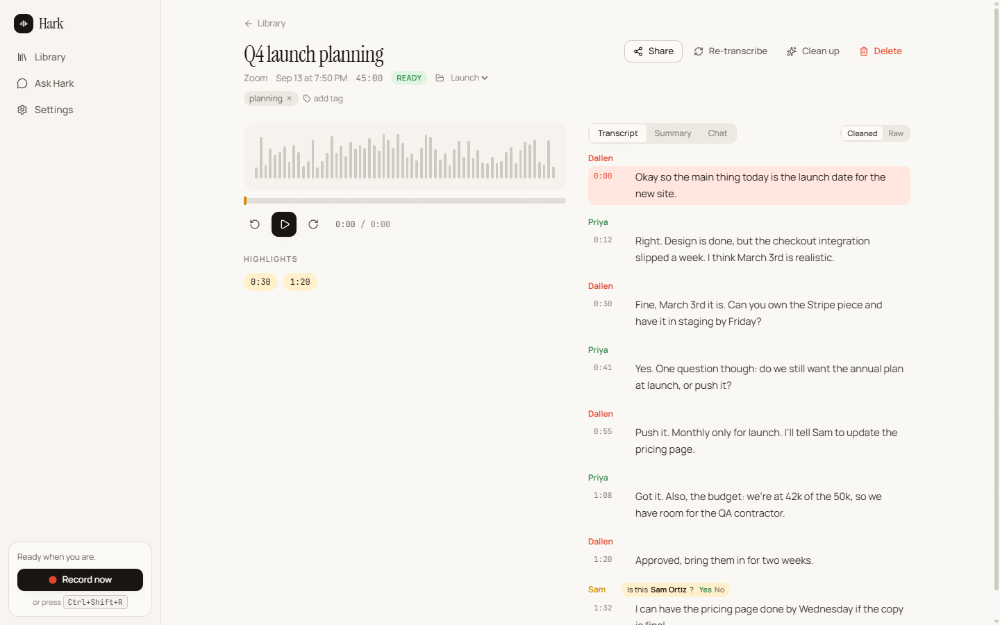
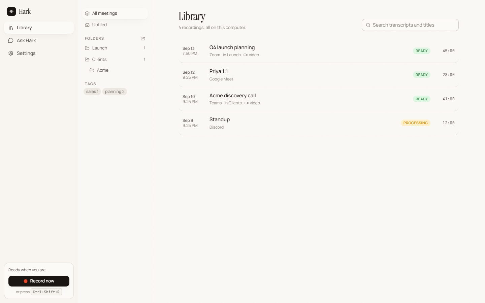

# Hark

**A free, open-source meeting recorder that keeps everything on your computer.**

Hark notices when you're in a call, offers a **Record** button (it never records on its own), asks which window to capture, records your mic plus that app's audio (and optional screen video), shows captions and running notes while the call is on, transcribes with speaker labels afterwards, and lets you ask a private, on-device AI about any meeting. No accounts. No cloud. No bot joining your calls.

> Think of it as an open-source, offline alternative to Fathom, Otter and Fireflies.



## What it does

- **Notices calls** in Zoom, Teams, Google Meet, Webex, Discord, Slack huddles, FaceTime, GoToMeeting, Whereby, Jitsi, Around, Skype, RingCentral, WhatsApp/Telegram/Signal calls - native or in a browser tab - and anything else via audio activity. Shows a small **Record?** popup; a global hotkey and tray menu open the same picker anytime.
- **Asks what to record first.** Pick the meeting window (or a display). On Windows Hark then captures **only that app's audio** plus your mic, so music, notifications and other calls stay out of the transcript; "Everything playing" is one click away.
- **Records** to disk continuously as separate tracks (mic, system, mix) plus optional screen video. If the audio device changes mid-call Hark switches to the current one and keeps going; a recording interrupted by a crash is finished automatically on the next launch.
- **Shows the meeting live.** Open the recording from the Library while it runs: captions land as people talk (the current line refines in place) and running notes - what's being discussed, decisions and action items so far - update a minute or two after new lines arrive.
- **Transcribes** with a full pass after the call, with **speaker labels**, in English or 30 other languages. Speaker detection runs across all your cores in parallel while whisper transcribes, so it never adds to the wait. Name a speaker once; Hark recognises their voice next time and asks you to confirm, and Ask Hark and the summary pick up the name. Attendee names from the meeting window or your calendar are offered as you type.
- **Cleans up** messy transcripts with a local language model: bad mics, broken English, filler. The raw transcript is always kept.
- **Summarises** instantly from editable templates (general, sales call, client discovery, 1:1, standup, interview), condensing long meetings part by part so nothing is dropped. Titles itself from the content.
- **Imports files** you already have - a phone voice memo, an old Zoom .mp4 - and treats them like a recording.
- **Drafts the follow-up email** from the notes, and exports transcripts as .txt / .srt / .md. Shows who spoke how much.
- **Answers questions** ("Ask Hark") about one meeting or your whole library with hybrid keyword + semantic search, citing timestamps you can click.
- **Organises** with folders, tags, search, highlights and clips.
- **Shares** via links on your network, `.hark` bundles you can import on another computer, or a standalone web page. An opt-in webhook pushes finished meetings to Zapier, n8n, Make or your own script.
- **Knows your calendar** from private .ics links (Google, Outlook): recordings take the event's name and attendees.
- **Updates itself** from signed GitHub releases, with your click.



## Install

Grab an installer from [Releases](https://github.com/Dallenlol/hark/releases): Windows (CPU or CUDA) and macOS (Apple Silicon or Intel). See [docs/install.md](docs/install.md).

## Status

**0.3.0** - third public build. See [CHANGELOG.md](CHANGELOG.md).

## Principles

- **Manual by design.** Detection only shows a popup. Recording, speaker names, and sharing all require a click.
- **Local only.** Recordings, transcripts, summaries and chat live in one folder you can back up or move. The only network call is downloading AI models from Hugging Face (verified by checksum).
- **Lightweight.** A Tauri app (Rust + React). Idle, it's a tray icon and a 2-second window poll. Models load only when needed.
- **Runs on real hardware.** Model sizes are picked for your machine, and on CPU-only machines Hark measures each speech model's real speed and picks the best one that finishes within the recording's own length. A GPU makes everything several times faster.

## Building from source

Requirements: [Rust](https://rustup.rs) (stable), [Node 22+](https://nodejs.org) with [pnpm](https://pnpm.io), CMake, a C++ toolchain (MSVC Build Tools on Windows, Xcode CLT on macOS), and libclang (LLVM) for the whisper.cpp bindings.

```bash
pnpm install
node scripts/prepare-bundle.mjs --profile dev   # downloads ffmpeg, builds the diarization sidecar, collects runtime libs
pnpm tauri dev
```

Installers: `node scripts/prepare-bundle.mjs && pnpm tauri build` for the CPU build. For the Windows CUDA build run both steps with `--features cuda` (CUDA 13 toolkit installed, `CUDA_PATH` set - the cuBLAS runtime is bundled), ideally in its own target directory: `CARGO_TARGET_DIR=target-cuda`. On macOS use `--features metal`. The CPU build targets AVX2 (see `.cargo/config.toml`), never the build machine's own CPU.

Tests:

```bash
cargo test --workspace
pnpm test
```

## Data location

- Windows: `%APPDATA%\Hark`
- macOS: `~/Library/Application Support/Hark`

Inside: `hark.db` (SQLite), `models/`, and `recordings/<meeting-id>/` with `mic.wav`, `sys.wav`, `mix.wav` and `screen.mp4`. Imported files get the same layout (`mix.wav` converted from the source). Logs: `%LOCALAPPDATA%\app.hark.desktop\logs\Hark.log` on Windows.

## Docs

[Install](docs/install.md) - [Models and hardware](docs/models.md) - [Privacy](docs/privacy.md) - [FAQ](docs/faq.md) - [Architecture](docs/dev/architecture.md)

## Contributing

See [CONTRIBUTING.md](CONTRIBUTING.md). Issues and PRs welcome; please keep the "manual by design" and "local only" principles.

## License

MIT
